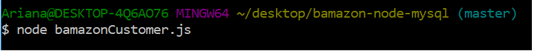
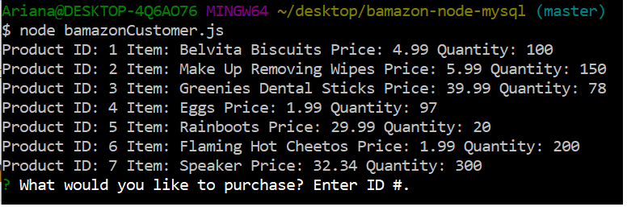
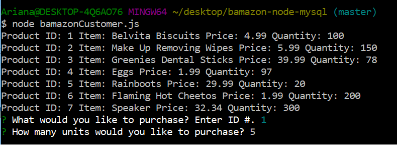
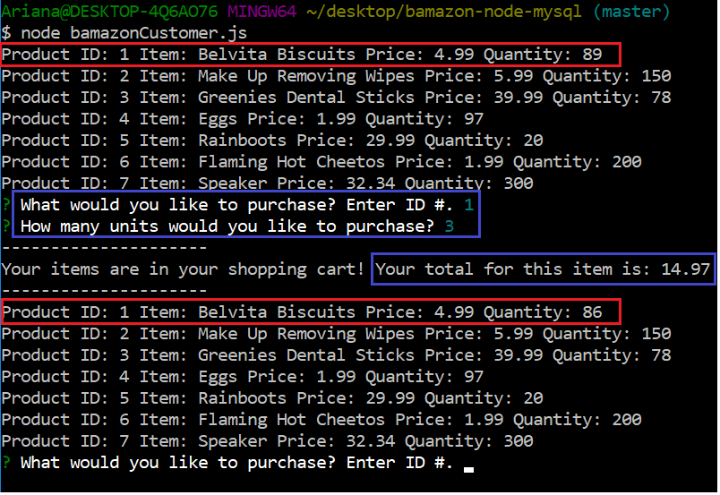

<h2> Bamazon: NODE.JS + SQL </h2>

Bamazon is an Amazon-like application used through the terminal. It requires the installation of npm packages, 'inquirer' and 'mysql'.

Once the packages are installed and you have secured a connection to a SQL Database, you can run the application as follows:

Enter 'node bamazonCustomer.js' into the terminal and press enter

Once the app is initiated, it will display the items available for purchase.

It will then prompt the user to enter the ID of the product they wish to purchase, as well a the # of units.

Upon entering your information, the app will update the quantity of the product you chose and will display your total cost for that item.

You can continue to run the app, or press CTRL + C to exit.